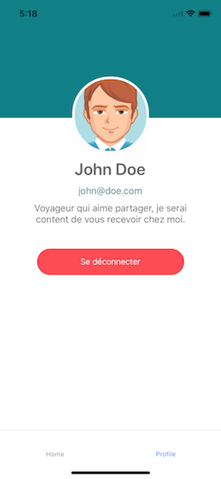
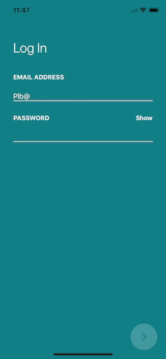
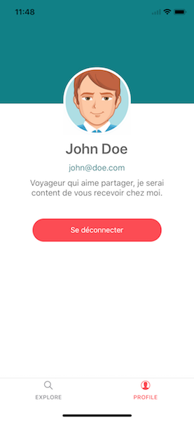

# TP 5 : Formulaire

## Objectifs

Mettre en place un formulaire de connection et une page de profil pour l'utilisateur.

## Préparatifs

1. Repartir des fichiers du TP précédent ou du dossier demarrage fourni. **NB :** Si vous repartez de vos fichiers, placez dans le répertoire data le fichier **user.json** fourni.

## Instructions

1. Nous allons dans un premier temps, retravailler notre navigation en ajoutant un "TabNavigator", le premier tab contiendra nos écrans déjà définis et le deuxième nous servira pour notre écran de profil. Nommer ces tabs "Explore" et "Profile".
2. Créer dans le dossier containers, un fichier Profile.js avec un simple composant.
3. La page de profil contiendra :

   - Un avatar
   - Un nom, un prénom
   - Un email
   - Une courte description de l'hôte

     Pour le moment, nous ne permettrons pas à l'utilisateur de charger ses informations, nous verrons plus tard comment changer l'avatar en accédant à l'appareil photo du téléphone. Nous allons fixer l'avatar avec l'url : "https://bootdey.com/img/Content/avatar/avatar6.png"

4. Mettez en place la page de profil, pour vous aider la hauteur du header est de 200 pixels, l'image a une taille de 130 pixels. Et voici les hexas des couleurs utilisées : "#118086" pour le vert, #fc4c54 pour le rouge et "#696969" pour le texte gris. La taille de la police du nom est de 28 et celle des autres textes est de 16. Le bouton déconnecter, a une largeur de 250 pixels, une hauteur de 45 et des coins arrondis de 20px.



5. Mettons maintenant en place le formulaire de connection avec simplement un email et un mot de passe. Je vous laisse libre de l'UI/UX de ce composant, ce n'est pas nécessaire qu'il soit beau, juste fonctionnel.
6. Vous pouvez ajouter de la validation : l'email doit être un email correcte ( utiliser une regexp ) et le mot de passe doit avoir au minimum 6 caractères.
7. Créer un répertoire api, dans lequel il y aura un fichier login et vérifier à la soumission du formulaire que les informations rentrées correspondent bien à celles fournies dans le fichier user.json. Sinon afficher une erreur à l'utilisateur.



## Pour aller plus loin :

1. Nous manquons d'icones dans cette application ( au niveau des tabs, dans les formulaires, etc ), il existe une lib référence pour les icones en react-native : [react-native-vector-icons](https://github.com/oblador/react-native-vector-icons).
2. Son installation se fait en deux parties :

- Installer React Native Vector Icons

  ```bash
      npm install --save react-native-vector-icons
  ```

- Lier les modules React Native au code source natif ( nous verrons plus tard pourquoi cette commande )

  ```bash
      react-native link
  ```

1. Vous avez maintenant accès à plus de 3000 icones : https://oblador.github.io/react-native-vector-icons/, utiliser les options de react navigation pour personnaliser vos icones.


